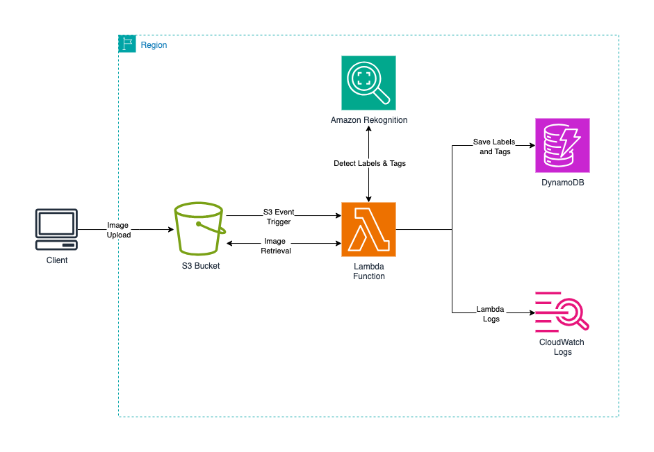

🖼 AWS Image Moderation Pipeline (Terraform)

A serverless pipeline to analyze and moderate images on AWS using Terraform Infrastructure as Code (IaC).
Users upload images → Rekognition detects moderation labels & tags → results are stored in DynamoDB → processing logs go to CloudWatch Logs.

🚀 Workflow

Upload → Images are uploaded to the S3 Bucket.

Trigger → An S3 event invokes the Lambda Function.

Process → Lambda retrieves the image and calls Amazon Rekognition.

Store → Moderation labels & tags are saved in DynamoDB.

Logs → Lambda execution details are logged to CloudWatch Logs.

🖼 Architecture

⚙️ Tech Stack

AWS S3 – Image storage & event trigger

AWS Lambda – Serverless processor

Amazon Rekognition – Image moderation (labels & tags)

Amazon DynamoDB – Stores moderation results

Amazon CloudWatch Logs – Centralized logging

📦 Deployment

cd envs/dev
terraform init
terraform apply